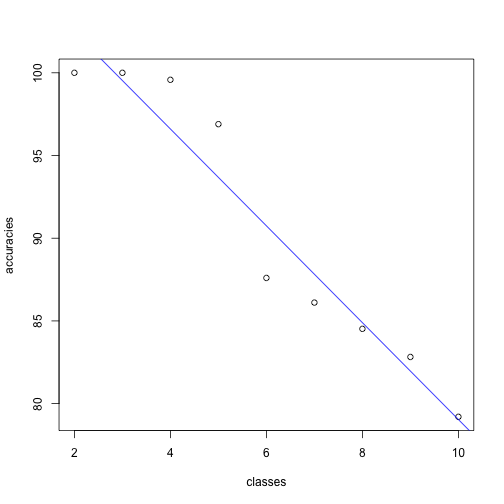

Effect of the number of classes on accuracy of classification
========================================================
author: Vladimir Metelitsa
date: 19/01/2017
autosize: true

Unsupervised and Supervised Classification
========================================================

We have gone over unsupervised and supervised classification in class.
Quick refresher:
- Unsupervised: 
- Supervised: 

What I made
========================================================

- Web interface to play with different inputs into classification
- Support for both unsupervised and supervised classification
- Customisable number of classes and sample size
- Display of accuracy for supervised classification

Demo time =)
========================================================

Results
========================================================

Clearly less accuracy the more classes we have.

But why?

Try it at home
========================================================

If you want to play with this, you can download it from my Github repository at: 

https://github.com/Green-Cat/M15RemoteSensingProject

Or try it online at a URL which will be added later to the description of my repo.
